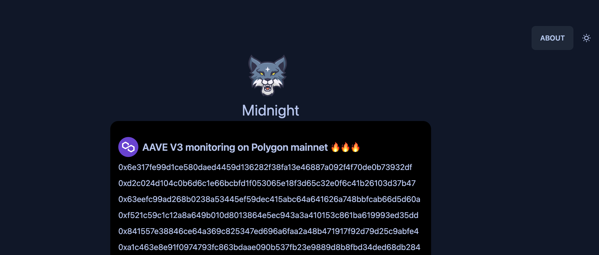

# Midnight



# Motivation 
The PoC made to prove the concept of real-time flash loan monitoring. which introduced in the paper "Midnight: An Efficient Event-driven EVM Transaction Security Monitoring Approach For Flash Loan Detection."
the emphasis of this PoC is to have easy to use interface plus use ```eth_subscribe``` rather than polling also decode events and making them locally queryable via PostgresSQL. this should allow researchers to easily generate cleaned dataset with 
fraction of cost of runnning an archive or for node. the inital paper was authored a long ago but as publication takes time we didn't publish code to follow the publication process. so many ideas never made it to code base. like round robin the providers to avoid rate limiting even further also as of now better tooling and libs as of now support ```eth_subscribe``` [web3.py](https://web3py.readthedocs.io/en/stable/releases.html#web3-py-v6-7-0-2023-07-26) and [viem also](https://viem.sh/docs/actions/public/watchBlockNumber.html#json-rpc-methods). whch makes those lib better bet for production grade code.


```bash
pnpm install

pnpm dev
```

then start engine by visited 
    
```bash
    http://localhost:port/engine
```

if all goes well  you should see 

```bash
{"EngineStarted":true}
```


then back to the main page start watching for transactions. the database contract a single table called ```transactions``` which contains all the transactions that are being watched.

```sql
-- Table Definition
CREATE TABLE "public"."Transactions" (
    "id" int4 NOT NULL DEFAULT nextval('transaction_id_seq'::regclass),
    "txHash" text,
    "txData" json,
    "createdAt" timestamp,
    "updatedAt" timestamp,
    PRIMARY KEY ("id")
);
```
